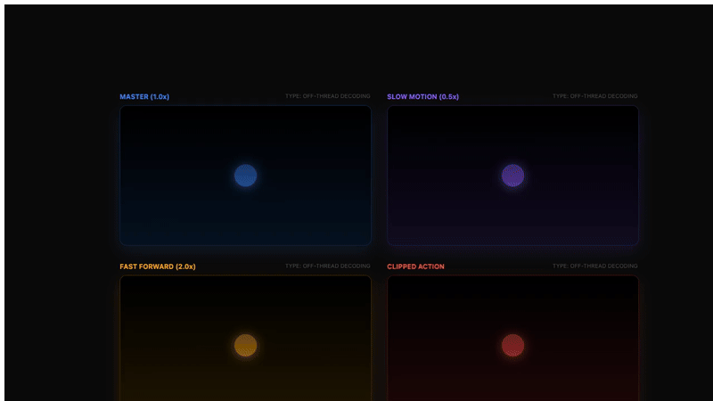

# OpenMotion

<p align="center">
  
</p>

<p align="center">
  <strong>专为 React 开发者打造的开源编程视频引擎。</strong>
</p>

<p align="center">
  <a href="#-features">特性</a> •
  <a href="#-installation">安装</a> •
  <a href="#-quick-start">快速开始</a> •
  <a href="#-packages">软件包</a>
</p>

---

OpenMotion 是 Remotion 的高性能开源替代方案。它允许你使用熟悉的 React 组件、Hooks 和你喜欢的 CSS 库来创建帧准确（frame-perfect）的视频。

### 🎬 展示

| 功能展示 | 媒体展示 |
| :---: | :---: |
|  |  |
| 品牌、仪表盘、缓动 | 视频、音频 |

## ✨ 特性

- ⚛️ **React 优先**: 充分利用 React 生态系统的全部力量。
- ⏱️ **帧准确的确定性**: 先进的时间劫持技术确保每一帧都完全一致。
- 🚀 **并行渲染**: 通过利用所有 CPU 核心来提升渲染速度。
- 🎵 **多轨音频混合**: 支持多个 `<Audio />` 且具有独立音量控制。
- 📈 **动画组件**: 内置循环（Loop）、过渡（Transitions）、缓动（Easing）等库。
- 📦 **外部集成**: 原生支持 **Three.js** 和 **Lottie** 动画。
- 💬 **字幕系统**: 自动化字幕渲染，支持 SRT 和 TikTok 风格动画。
- 📊 **媒体分析**: 动态提取视频/音频元数据（时长、尺寸）。
- 📹 **离线视频**: 高性能视频解码移至后台进程。
- 📊 **动态元数据**: 根据输入 props 动态计算视频尺寸、时长等属性。
- 🎬 **GIF & 视频输出**: 支持渲染为 MP4 视频和 GIF 格式，具有自动格式检测。

### 4. 渲染视频 (正式出片)

推荐使用项目自带的 `render` 脚本进行渲染。它会自动完成 **构建 -> 启动静态服务 -> 渲染 -> 自动清理** 的全套流程，确保渲染过程极其稳健，不会因开发服务器缓冲区问题而卡死。

```bash
# 一键渲染 (默认输出 ./out.mp4，开启 4 线程并行)
npm run render

# 修改输出文件名或指定合成 ID (通过 -- 透传参数)
npm run render -- -o my-video.mp4 -c main
```

## 💡 最佳实践

### 稳健渲染方案
生产环境建议始终优先使用 `npm run render`。该命令内部使用了静态服务模式，彻底告别渲染卡死。

### 参数透传技巧
你可以通过 `npm run render -- [更多参数]` 覆盖脚本中的默认值：
- **修改并发数**: `npm run render -- -j 8`
- **指定 Chromium 路径**: `npm run render -- --chromium-path "/path/to/chrome"`

### 资源存放
所有本地图片/视频资源请放在 `public/` 目录下，在代码中通过 `/filename` 路径引用。

## 🎬 输出格式支持
- **.mp4**: 标准视频，包含音频。
- **.webm**: 支持透明背景的高质量视频。
- **.gif**: 动态图片，不含音频。
- **.webp**: 现代动图格式，体积更小，质量更好。

## 🛡️ 特色功能
- 🛡️ **运行前检查**: 内置浏览器安装检查与环境验证。
- 🌍 **自定义 Chromium 路径**: 支持通过 `--chromium-path` 参数自定义浏览器路径。
- 🚀 **快速渲染**: 一键自动化构建与全自动渲染链条。

## 📚 API 参考

动态计算视频属性：

```tsx
<Composition
  id="dynamic-video"
  component={VideoComponent}
  width={1280}
  height={720}
  fps={30}
  durationInFrames={300}
  calculateMetadata={async (props) => {
    const meta = await getVideoMetadata(props.src);
    return {
      width: meta.width,
      height: meta.height,
      durationInFrames: Math.ceil(meta.durationInSeconds * 30)
    };
  }}
/>
```

## 📦 软件包

| 软件包 | 描述 |
| :--- | :--- |
| [`@open-motion/core`](./packages/core) | React 基元 (`Composition`, `Sequence`, `Loop`), Hooks, 以及媒体工具 (`getVideoMetadata`, `parseSrt`)。 |
| [`@open-motion/components`](./packages/components) | 高级组件 (`Transition`, `ThreeCanvas`, `Lottie`, `Captions`, `TikTokCaption`)。 |
| [`@open-motion/renderer`](./packages/renderer) | 基于 Playwright 的捕获引擎。 |
| [`@open-motion/cli`](./packages/cli) | 命令行界面。 |

## 🛠 安装

```bash
npm install @open-motion/core @open-motion/components
```

## 🚀 快速开始

### 安装

```bash
# 全局安装 CLI 工具
pnpm install -g @open-motion/cli @open-motion/renderer

# 安装 Playwright 浏览器 (渲染必需)
npx playwright install chromium
```

### 创建并运行你的第一个项目

```bash
# 创建新项目
open-motion init fun-video
cd fun-video && pnpm install

# 启动开发服务器
# 在一个终端运行 - 它会显示端口 (例如 5173)
pnpm run dev
```

**注意**: 保持此终端开启。如果端口 5173 已被占用，Vite 会自动尝试 5174, 5175 等。请检查输出以获取实际端口号。

### 渲染你的视频

在另一个终端中，使用上面的端口渲染项目：

```bash
# 渲染为 MP4 (30fps 下 14 秒)
open-motion render -u http://localhost:5173 -o out.mp4 --duration 420

# 渲染为 GIF (30fps 下 14 秒)
open-motion render -u http://localhost:5173 -o out.gif --duration 420

# 渲染为 WebP (质量优于 GIF)
open-motion render -u http://localhost:5173 -o out.webp --duration 420

# 渲染为 WebM (支持透明视频)
open-motion render -u http://localhost:5173 -o out.webm --duration 420
```

**时长解释**: `--duration 420` 表示 420 帧。在 30fps 下，即 420 ÷ 30 = **14 秒** 视频。

### 创建一个 Composition

```tsx
import { Composition, useCurrentFrame, interpolate } from "@open-motion/core";
import { Transition, TikTokCaption } from "@open-motion/components";

const MyScene = () => {
  const frame = useCurrentFrame();
  return (
    <Transition type="fade">
      <div style={{ flex: 1, backgroundColor: 'black', color: 'white' }}>
        <TikTokCaption text="Hello OpenMotion" active={true} />
      </div>
    </Transition>
  );
};
```

**关于端口的注意**: 如果端口 5173 已被占用，Vite 会自动尝试 5174, 5175 等。请查看开发服务器输出以获取实际端口号 (例如 "Local: http://localhost:5177/")。

## 📚 API 参考

所有 OpenMotion 特性和组件的完整参考。

### 核心 Hooks

**`useCurrentFrame()`**
获取动画中的当前帧数。

```tsx
const frame = useCurrentFrame();
const opacity = interpolate(frame, [0, 30], [0, 1]);
```

**`useVideoConfig()`**
访问视频配置 (width, height, fps, durationInFrames)。

```tsx
const { width, height, fps } = useVideoConfig();
```

### 动画 & 过渡

**`<Loop durationInFrames={30}>`**
为子动画创建循环的时间上下文。

```tsx
<Loop durationInFrames={60}>
  <SpinningLogo />
</Loop>
```

**`<Transition type="wipe" direction="right">`**
平滑的进入/退出过渡。类型：`fade`, `wipe`, `slide`, `zoom`。

```tsx
<Transition type="wipe" direction="right">
  <Title text="Hello World" />
</Transition>
```

**`Easing.inOutExpo`**
完整的缓动函数库：
- `Easing.linear`, `Easing.easeIn`, `Easing.easeOut`, `Easing.easeInOut`
- `Easing.inOutCubic`, `Easing.outBack`, `Easing.inExpo` 等

```tsx
const value = interpolate(frame, [0, 30], [0, 100], {
  easing: Easing.outCubic,
});
```

### 3D & Lottie 集成

**`<ThreeCanvas />`**
渲染与视频帧同步的 Three.js 场景。详情见 `packages/components`。

**`<Lottie url="..." />`**
具有帧准确控制的声明式 Lottie 动画。

```tsx
<Lottie url="/animations/logo.json" />
```

### 媒体 & 字幕

**`<Audio src="..." volume={0.8} />`**
多轨音频支持，具有独立音量和定时。

```tsx
<Audio src="/music.mp3" volume={0.5} startFrom={30} startFrame={60} />
```

**`parseSrt(srtContent)`**
将 SRT 字幕文件转换为数组。

```tsx
const subtitles = parseSrt(await fetch('/subtitles.srt').then(r => r.text()));
```

**`<Captions subtitles={subtitles} />`**
具有样式选项的灵活字幕渲染器。

```tsx
<Captions subtitles={subtitles} color="white" fontSize={24} />
```

**`<TikTokCaption />`**
预设样式的 TikTok 类动画字幕组件。

**`getVideoMetadata(url)`**
获取视频尺寸和时长。

```tsx
const { width, height, durationInSeconds } = await getVideoMetadata('/video.mp4');
```

**`<OffthreadVideo src="..." />`**
后台进程中的高性能视频解码。

### 输出 & 导出选项

**CLI 命令**

```bash
# 基础渲染
open-motion render -u http://localhost:5173 -o video.mp4

# 使用自定义设置
open-motion render -u http://localhost:5173 -o video.mp4 \
  --duration 420 \
  --width 1920 \
  --height 1080 \
  --fps 30

# 渲染为 GIF
open-motion render -u http://localhost:5173 -o animation.gif \
  --duration 420 \
  --public-dir ./public
```

**文件格式**
- **MP4**: 包含音频支持的完整视频 (H.264)
- **WebM**: 支持透明度的 Web 优化视频 (VP9)
- **GIF**: 轻量级动画 (无音频)
- **WebP**: 高质量动画图像 (优于 GIF，无音频)

**质量参数**
- `--width`: 输出宽度（像素）
- `--height`: 输出高度（像素）
- `--fps`: 每秒帧数 (默认: 30)
- `--duration`: 总帧数 (例如: 420 = 30fps 下 14 秒)
- `--format`: 显式格式 (mp4, webm, gif, webp, auto)

## 📜 许可证

MIT © [jsongo](https://github.com/jsongo)
